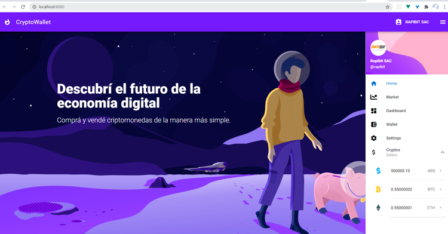
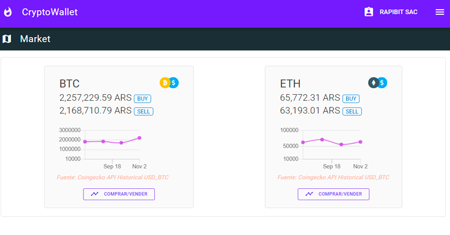
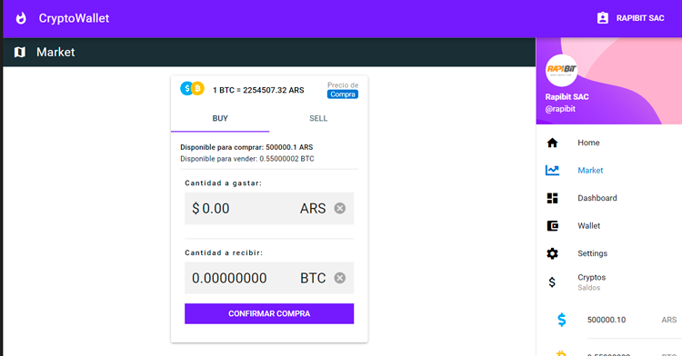
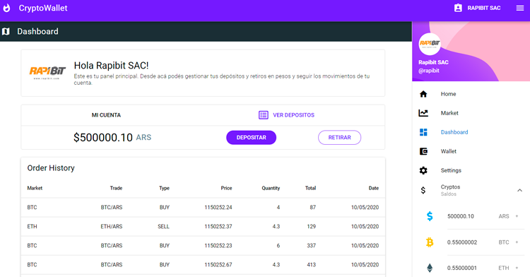

# crypto-wallet-v1 (Vue Vuex Quasar Framework Firebase Project)

<h4>DESCRIPTION:</h4>
<h3>CryptoWallet - Buy/Sell Cryptos in your local fiat currency</h3>

### Home - Login with Gmail


### RealTime API for crypto market prices


### Buy or sell Crypto


### Dashboard


#### clone repo for more pages


#### Install the dependencies
```bash
npm install
```

#### Start the app in development mode (hot-code reloading, error reporting, etc.)
```bash
quasar dev
```

### Lint the files
```bash
npm run lint
```

### Build the app for production
```bash
quasar build
```

### Customize the configuration
See [Configuring quasar.conf.js](https://quasar.dev/quasar-cli/quasar-conf-js).
